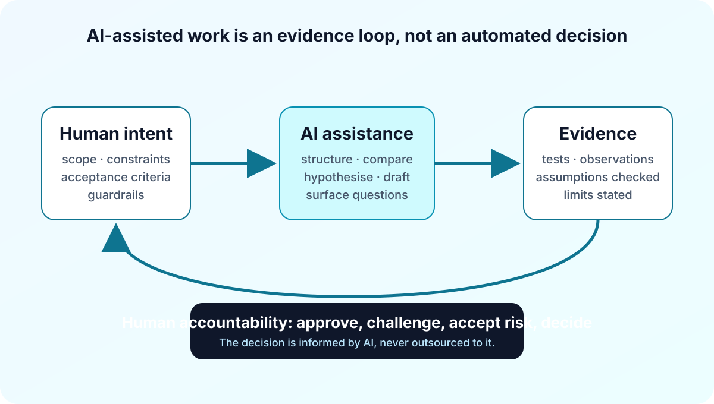

Over the past year, I have spent a lot of time asking a practical question:

> **Where does AI genuinely improve architecture work, and where does it merely make an answer look finished before it is understood?**

The answer has not been “everywhere.” It has been more useful than that.

AI has changed the shape of my work. It helps me get from a vague problem to a structured investigation more quickly. It can compare options, turn a rough brief into questions, and keep a thread of evidence together while I work. But it has not changed the part that matters most: someone still has to understand the constraints, decide what is acceptable, and own the consequences.

This is a reflection on the workflow, not a description of any internal system, customer environment, or delivery.

## The useful shift: from blank page to working structure

The first benefit I noticed was not automated configuration. It was preparation.

Large point-to-point build plans are a good example. The difficult part is rarely producing a long list of links. The difficult part is keeping endpoint naming, capacity assumptions, sequencing, dependencies, ownership, and review questions coherent while the plan evolves.

An AI-assisted workflow can turn a loosely described requirement into a planning structure: fields that need to exist, assumptions that need confirmation, checks that expose omissions, and a format that another engineer can review. That is valuable because it changes the early conversation from “please fill in this spreadsheet” to “what must be true before this work can begin?”

But a polished schedule is not a validated schedule. The architect still needs to challenge the input, resolve ambiguity, and decide whether the plan represents a buildable design. AI can make the gaps visible. It cannot responsibly decide that a gap is safe to ignore.

## Troubleshooting became a loop, not a clever prompt

The same pattern applies when something is wrong.

The attractive idea is to ask an agent to diagnose a network and receive the answer. In practice, the reliable workflow is less dramatic:

1. Establish the intended behaviour and the scope.
2. Collect observable state before making a theory.
3. Form a hypothesis that can be disproved.
4. Run the smallest useful check.
5. Record what the evidence supports, what it does not, and what should happen next.

An agent is helpful at keeping that loop disciplined. It can suggest questions, correlate output, and remind me when I have jumped from a healthy control plane to an unproven forwarding claim.

That last point matters. “The session is up” and “the service works as intended” are not the same statement. In my personal lab work, I have found the most useful AI assistance is often the prompt to collect the next piece of evidence rather than a confident root-cause paragraph.

## One intent can have more than one implementation

Cross-platform development gave me another useful perspective.

I can describe a desired outcome once: resilience, isolation, reachability, operational visibility. Different platforms will express that outcome differently. The syntax, state model, and validation commands may all change. The design intent should not.

That is where AI can be a good translator, but a poor authority. It can help compare native approaches and prepare an implementation path for each platform. It should not be allowed to pretend that similar-looking configuration is equivalent behaviour.

My recent personal lab experiment with SONiC and Cumulus made this concrete. The agent could work across both platforms, but the important work was still validating the route behaviour, the multipath outcome, and the boundary of what the lab had actually proved.

## Governance is not the paperwork after the work

The most interesting use of AI may be in architecture governance.

Good governance is often dismissed as documentation overhead. I see it differently. It is the record of why a decision was made, which constraints were accepted, what evidence was available, and what must be revisited later.

AI can make that record easier to maintain. It can turn a workshop into a decision log, compare a proposed design against stated principles, surface unresolved assumptions, and draft a risk register for human review. Those are meaningful improvements.

The decision itself remains human. A model does not sit with the operational impact of a shortcut. It does not accept residual risk on behalf of a team. It does not explain a trade-off to the people who will live with it.

## The boundary I want to keep

I am becoming more comfortable asking AI to help with the work around architecture: structuring, comparing, investigating, documenting, and checking whether the evidence is complete.

I am not comfortable delegating responsibility for architecture.

That distinction gives me a practical test for every new workflow. If AI makes the reasoning more visible, the evidence easier to inspect, and the hand-off clearer, it is helping. If it hides uncertainty behind fluent output or makes it less clear who owns the decision, it is moving in the wrong direction.

The next posts in this series will explore those workflows in more detail: planning before the build, troubleshooting through evidence loops, and using AI to make design governance more useful rather than more ceremonial.
