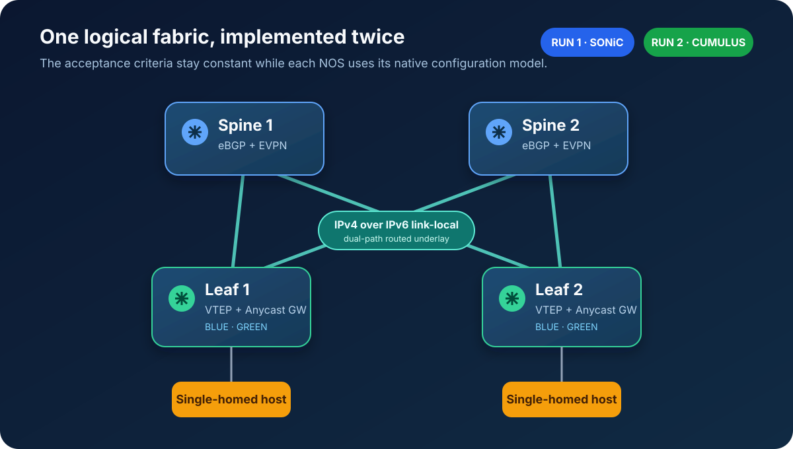
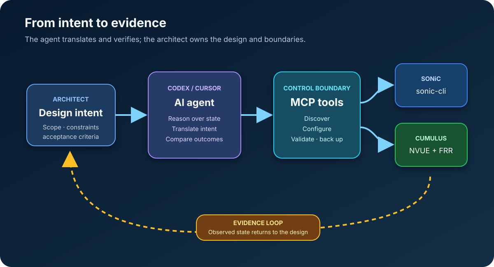
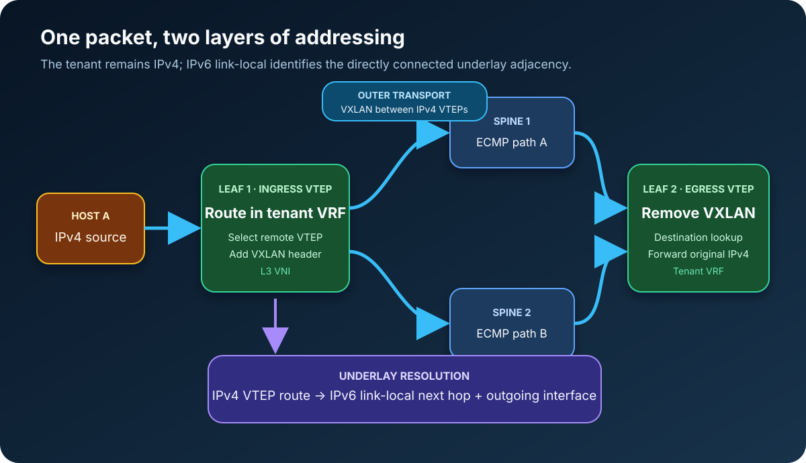

I have not been updating this blog much since starting my new role. A new environment brings a different rhythm, and most of my energy has gone into listening, learning, and understanding new challenges.

But I have continued building things in my personal lab.

One weekend, I opened EVE-NG and returned to a question that has followed me through several automation projects:

> **What if I describe the network once, then ask an AI agent to build it on two different network operating systems?**

Not generate two piles of CLI. Build the fabric, inspect what actually happened, fix what does not match the intent, and leave behind enough evidence to reproduce it.

That became this experiment.

Everything described here was built independently in my personal EVE-NG environment from public product documentation. It does not represent an employer, customer, or production network.

---

## The challenge I gave the agent

I started with a four-switch fabric: two spines and two leaves.

The first version ran **SONiC Enterprise**. After it was working, I shut that lab down and recreated the same logical design on **NVIDIA Cumulus Linux**.

The brief was deliberately written as design intent:

~~~text
Build a two-spine, two-leaf EVPN-VXLAN fabric.

Use eBGP unnumbered between every leaf and spine.
Carry IPv4 routes over IPv6 link-local next hops.
Use both spines as equal-cost paths.

Create two tenant VRFs.
Give each tenant two VLANs and one L3 VNI.
Use distributed anycast gateways on both leaves.

Validate the result and save the final configurations.
~~~

The topology and expected forwarding behavior stayed constant. The syntax did not.

On SONiC, the agent worked through **sonic-cli**. On Cumulus, it used **NVUE** and FRR. My intention was not to make one platform imitate the configuration structure of the other. I wanted each platform to express the same design in its native way.

---

## EVE-NG supplied the devices. MCP supplied the boundary.

I have previously written about moving labs to Containerlab. I still enjoy that workflow, especially when a useful container image is available.

This experiment needed virtual network appliances and their native management experience, so EVE-NG was the right runtime. I cabled the topology there and left the operational workflow to Codex, Cursor, and MCP.

The roles were clear:

- **EVE-NG** ran the topology.
- **I** defined the design, scope, and acceptance criteria.
- **Codex and Cursor** interpreted the request and reasoned over live results.
- **MCP** exposed controlled discovery, configuration, and verification actions.
- **SONiC and Cumulus** remained the systems of record for their own state.

MCP was useful because it turned the interaction into more than a chat window connected to SSH. The workflow could distinguish between reading state, preparing configuration, applying it, saving it, and collecting evidence.

That boundary also made the scope explicit. Four switches were in scope. The simulated external router was not. When I mentioned a host-facing interface, the agent could configure the leaf side without wandering into a device I had excluded.

---

## The agent began by looking

The first useful action was not configuration. It was discovery.

The agent connected to all four nodes and answered a few basic questions:

- Which software and release was running?
- What were the actual hostnames?
- Which interfaces existed?
- Which ports connected each leaf to each spine?
- Was management isolated from the default routing table?
- Was there already configuration worth preserving?

This sounds routine, but it changes the quality of the work. A design request always contains assumptions. Discovery turns those assumptions into observed facts.

On the SONiC lab, this included standardising the interface display so the port names matched the way I wanted to operate the switches. On the Cumulus lab, it confirmed that **eth0** was already using the management VRF and that the fabric ports were initially clean.

Only then did the agent turn the architecture brief into candidate configuration.

---

## Two NOSs, one intended outcome

The underlay used a different private ASN per switch and eBGP unnumbered on every fabric link. Loopbacks served as router IDs and VTEP addresses.

The overlay contained:

- Two tenant VRFs
- Four VLANs
- Four L2 VNIs
- Two L3 VNIs
- A shared anycast gateway for each subnet
- A common anycast router MAC
- ARP and ND suppression

There was no EVPN multihoming in this version. Each endpoint attachment was single-homed, so there was no Ethernet Segment Identifier to configure.

The SONiC and Cumulus command models looked very different. Yet the questions used to judge them were identical:

- Are all underlay peers established?
- Are all EVPN peers established?
- Can each leaf reach the other VTEP?
- Does the route use both spines?
- Are the expected VNIs operational?
- Is each L3 VNI attached to the correct tenant VRF?
- Are the gateway addresses present on both leaves?
- Is the final state saved?

That common checklist became the real portability layer.

---

## Everything was green—except the forwarding path

The most interesting moment came after the Cumulus configuration was applied.

Every fabric interface was up. Every IPv4-unicast BGP session was established. Every EVPN session was established. The VNIs appeared. At first glance, the job looked complete.

Then the agent checked the route to the remote VTEP.

There was only one next hop.

Both spines advertised reachability, but the paths contained different spine ASNs. Without BGP multipath relaxation, the leaf selected one path instead of installing both.

The agent found the mismatch, enabled multipath relaxation across the fabric, saved the change, and checked again.

~~~text
Remote VTEP /32
  via IPv6 link-local next hop on swp1
  via IPv6 link-local next hop on swp2
~~~

Now the forwarding table matched the original intent: two equal-cost paths, one through each spine.

This small discovery captured the point of the whole exercise.

> **A configuration can be accepted. Every session can be established. The design can still be wrong.**

If the task had ended at “the commands succeeded,” I would have missed the problem.

---

## How an IPv4 packet uses an IPv6 next hop

The unnumbered underlay can look strange the first time you inspect it.

The tenant packet is IPv4. The VTEP addresses are IPv4. Yet the route to the remote VTEP points to an IPv6 link-local address.

The two address families have different jobs:

1. A host sends an IPv4 packet to its anycast gateway on Leaf 1.
2. Leaf 1 performs the tenant VRF lookup and selects the remote VTEP.
3. The IPv4 route to that VTEP resolves over an IPv6 link-local neighbour on the chosen fabric interface.
4. Leaf 1 encapsulates the tenant frame in VXLAN.
5. The routed underlay transports the outer packet through either spine.
6. Leaf 2 removes the VXLAN header, performs the destination-side forwarding, and sends the original IPv4 packet toward the endpoint.

The IPv4 destination never turns into IPv6. IPv6 link-local addressing identifies the directly connected underlay adjacency used to reach the IPv4 VTEP.

Because both spine paths were installed, the fabric could use either adjacency.

---

## Symmetric IRB was visible before hosts were attached

The lab had four operational L2 VNIs and two operational L3 VNIs. Each leaf saw the other as a remote VTEP, and the tenant VRFs had the expected distributed gateways.

That proved the basic EVPN control plane and VXLAN tunnel model were in place.

But I had deliberately told the agent to ignore the simulated external router. No active endpoints were generating tenant traffic. That meant there were limits to what could honestly be claimed:

- No remote host MAC/IP meant no meaningful Type-2 endpoint proof.
- No cross-subnet host flow meant no end-to-end symmetric-IRB packet capture.
- The L3 VNIs and distributed gateways were ready, but an endpoint test would still be needed to prove the complete data path.

I liked that the final report said so.

Automation evidence should show both what was proven and what remains untested. A long list of green checks is less useful if it quietly ignores the missing test conditions.

---

## The output was evidence, not a terminal transcript

At the end, the agent left behind:

- A discovered topology
- A short architecture record
- The final configuration for every switch
- Platform-specific restoration commands
- BGP and EVPN post-checks
- VNI state
- ECMP proof for the remote VTEPs
- A clear note about the endpoint tests still outstanding

This changed the experience of operating the lab.

Normally, I finish an experiment with several terminal windows, a few screenshots, and the vague belief that I will document it later. This time, documentation was produced as part of completing the change.

The record connected three things:

> **What I asked for → What the platforms received → What the network proved**

That is much closer to how I want network engineering work to feel.

---

## What AI changed for me

The agent handled the repetitive parts well:

- Querying four devices in parallel
- Translating intent into two configuration models
- Comparing expected and observed state
- Repeating validation consistently
- Preserving configurations and evidence
- Following a problem from symptom to correction

I still made the architectural decisions. I chose the topology, routing model, tenants, anycast design, boundaries, and success criteria. When management access could have been affected, I decided how much risk was acceptable.

The useful shift was not “AI writes network CLI.”

It was this:

> **I spent more time describing correct behavior and less time transcribing syntax.**

That is a much more interesting use of an AI agent for network engineering.

---

## What would have to change for production

This was a personal lab, and I treated it as one.

A production implementation would need stronger controls around:

- Identity and role-based access
- Secrets storage and rotation
- Approved command and API scopes
- Candidate configuration review
- Change windows and governance
- Audit logs
- Automated rollback
- Independent pre-change and post-change policy checks

The lab does not prove that an AI agent should be given unrestricted access to a production network.

It does show that an agent can operate inside a defined boundary, translate intent into native platform actions, and validate the result against measurable outcomes.

That is enough to make the next experiment worthwhile.

---

## What comes next

The next step is to move the shared fabric definition into a small vendor-neutral data model.

Instead of restating the design in conversation, I want to define the nodes, links, ASNs, loopbacks, tenants, VLANs, VNIs, and validation rules as structured intent. The platform adapters can change while the acceptance tests remain stable.

I also want to extend the lab with:

- Endpoint-driven EVPN Type-2 learning
- Symmetric-IRB packet captures
- Type-5 prefix advertisement
- Spine and link failure tests
- Deliberate configuration drift
- Automated rollback exercises
- A third NOS using the same intent

The question is no longer whether an AI agent can produce CLI.

The better question is:

> **Can one design intent survive different platforms and still produce the same provable network behavior?**

For this small fabric, the answer is beginning to look like yes.
